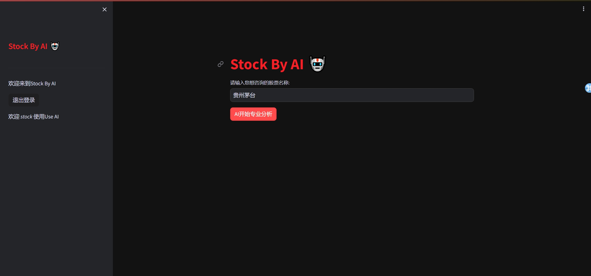
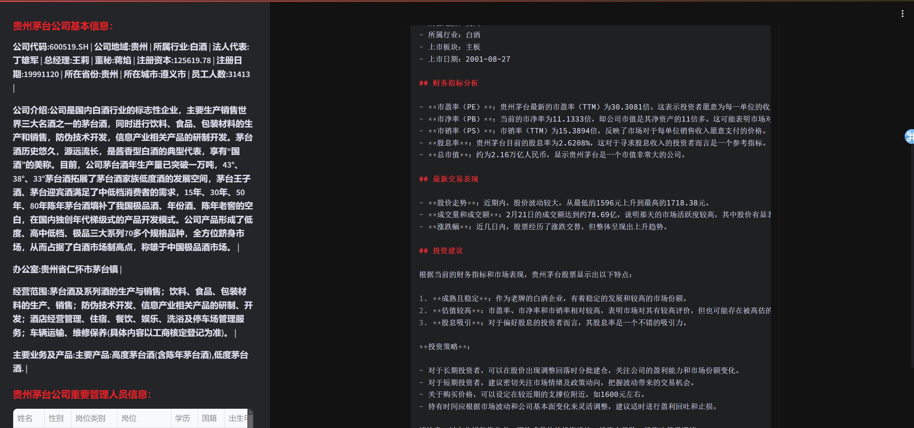

# Stock_by_ai
AI针对目标股票最新财务数据、行业信息、日线行情进行多方面分析。
生成专业投资文档，用数据说话，协助投资者更理性进行操作
## 产品Demo

* 体验产品：

<a href="http://180.76.244.179:8505/">
<button style="background-color: #007bff; color: white; padding: 10px 20px; border: none; border-radius: 5px;">Demo体验</button>
</a>

* 产品页面：

* 运行结果：

## 待完善功能

- [ ] 根据最新公司新闻进行分析预判

- [ ] 同行业公司数据进行多维度分析

- [ ] 更全面数据进行分析

- [ ] 行业数据进行多维度分析

- [ ] 量化模型

## 联系我

